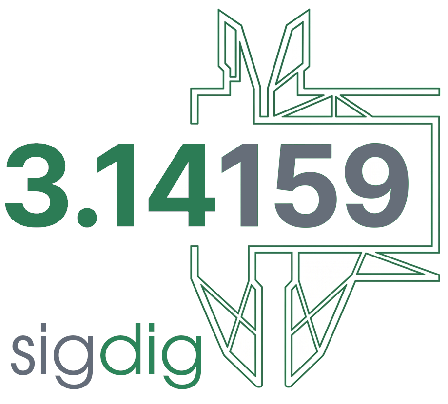

<p align="center">
  
</p>

# significantdigits package - v0.5.1

<p align="center">
  
</p>

<p align="center">
  <a href="https://github.com/verificarlo/significantdigits/actions/workflows/python-app.yml"></a>
  <a href="https://pypi.org/project/significantdigits/"></a>
  <a href="https://pypi.org/project/significantdigits/"></a>
  <a href="https://verificarlo.github.io/significantdigits/"></a>
  <a href="https://llvm.org/LICENSE.txt"></a>
  <a href="https://doi.org/10.5281/zenodo.21362284"></a>
</p>

Compute the number of significant digits based on the paper [Confidence Intervals for Stochastic Arithmetic](https://dl.acm.org/doi/10.1145/3432184) (also available as a free preprint on [arXiv](https://arxiv.org/abs/1807.09655)).
This package is also inspired by the [Jupyter Notebook](https://github.com/interflop/stochastic-confidence-intervals/blob/master/Intervals.ipynb) included with the publication.


## Table of Contents

- [significantdigits package - v0.5.1](#significantdigits-package---v051)
  - [Table of Contents](#table-of-contents)
  - [Getting started](#getting-started)
  - [Installation](#installation)
  - [GPU support](#gpu-support)
  - [Examples](#examples)
  - [Advanced Usage](#advanced-usage)
    - [Inputs types](#inputs-types)
    - [Z computation](#z-computation)
    - [Methods](#methods)
    - [Significant digits](#significant-digits)
    - [Contributing digits](#contributing-digits)
    - [Formatting Results with `format_uncertainty`](#formatting-results-with-format_uncertainty)
    - [Utils function](#utils-function)
      - [`change_basis`](#change_basis)
      - [`probability_estimation_bernoulli`](#probability_estimation_bernoulli)
      - [`minimum_number_of_trials`](#minimum_number_of_trials)
  - [Recent Improvements](#recent-improvements)
  - [Testing](#testing)
    - [Running Tests](#running-tests)
    - [Test Categories](#test-categories)
    - [Mathematical Properties Tested](#mathematical-properties-tested)
    - [License](#license)
  - [Citation](#citation)

## Getting started

This synthetic example illustrates how to compute significant digits
of a results sample with a given known reference:

```python
>>> import significantdigits as sd
>>> import numpy as np
>>> from numpy.random import uniform as U
>>> np.random.seed(0)
>>> eps = 2**-52
>>> # simulates results with epsilon differences
>>> X = [1+U(-1,1)*eps for _ in range(10)]
>>> sd.significant_digits(X, reference=1)
>>> 51.48272220711583
```

or with the CLI interface assuming `X` is in `test.txt`:

```bash
> significantdigits --metric significant -i "$(cat test.txt)" --input-format stdin --reference 1
> (array(51.48272221),)
```
If the reference is unknown, one can use the sample average:

```python
...
>>> sd.significant_digits(X, reference=np.mean(X))
>>> 51.48272220711583
```

To print the result as mean +/- error, use the format_uncertainty function:

```python
>>> print(sd.format_uncertainty(X, reference=1))
>>> ['+1.00000000000000000 ± 1.119313369151395181e-16'
     '+1.00000000000000000 ± 1.119313369151395181e-16'
     '+1.00000000000000000 ± 1.119313369151395181e-16'
     '+1.00000000000000000 ± 1.119313369151395181e-16'
     '+1.00000000000000000 ± 1.119313369151395181e-16'
     '+1.00000000000000000 ± 1.119313369151395181e-16'
     '+1.00000000000000000 ± 1.119313369151395181e-16'
     '+1.00000000000000022 ± 1.119313369151395181e-16'
     '+1.00000000000000022 ± 1.119313369151395181e-16'
     '+1.00000000000000000 ± 1.119313369151395181e-16']
```

## Installation

```bash
uv add significantdigits
```

or if you want the latest version of the code, you can install it **from** the repository directly

```bash
uv add "significantdigits @ git+https://github.com/verificarlo/significantdigits.git"
# or if you don't have 'git' installed
uv add "significantdigits @ https://github.com/verificarlo/significantdigits/zipball/master"
```

## GPU support

`significantdigits` has an optional GPU backend based on [CuPy](https://cupy.dev/).
When inputs are `cupy.ndarray`, all computations run on the GPU and results are
returned as `cupy.ndarray` (call `.get()` to move them back to the host).

Install the extra matching your CUDA toolkit version:

```bash
uv add "significantdigits[gpu]"          # CUDA 12.x (default)
uv add "significantdigits[gpu-cuda11x]"  # CUDA 11.x
```

Usage is identical to the NumPy case; only the array type changes:

```python
>>> import cupy as cp
>>> import significantdigits as sd
>>> eps = 2**-52
>>> X = 1 + cp.random.uniform(-1, 1, 10) * eps
>>> s = sd.significant_digits(X, reference=1)  # runs on the GPU
>>> s.get()  # transfer back to the host
array(51.48272221)
```

Mixing inputs is supported: if the array is on the GPU and the reference is a
NumPy array or scalar, the reference is transferred to the GPU automatically.
`format_uncertainty` always returns NumPy arrays of strings since formatting
happens on the host.

## Examples

The [`examples`](./examples) directory contains several example scripts demonstrating how to use the `significantdigits` package in different scenarios. You can find practical usage patterns, sample data, and step-by-step guides to help you get started or deepen your understanding of the package's features. 

## Advanced Usage

### Inputs types

Functions accept the following types of inputs:
```python
    InputType: ArrayLike
```
Those types are accessible with the `numpy.typing.ArrayLike` type.

### Z computation
Metrics are computed using Z, the distance between the samples and the reference.
There are four possible cases depending on the distance and the nature of the reference that are summarized in this table:

|                    | constant reference (x) | random variable reference (Y) |
| ------------------ | ---------------------- | ----------------------------- |
| Absolute precision | Z = X - x              | Z = X - Y                     |
| Relative precision | Z = X/x - 1            | Z = X/Y - 1                   |


```python
_compute_z(array: InternalArrayType, 
           reference: InternalArrayType | None, 
           error: Error | str, 
           axis: int, 
           shuffle_samples: bool = False) -> InternalArrayType
    Compute Z, the distance between the random variable and the reference

    Compute Z, the distance between the random variable and the reference
    with three cases depending on the dimensions of array and reference:

    X = array
    Y = reference

    Three cases:
    - Y is none
        - The case when X = Y
        - We split X in two and set one group to X and the other to Y
    - X.ndim == Y.ndim
        X and Y have the same dimension
        It it the case when Y is a random variable
    - X.ndim - 1 == Y.ndim or Y.ndim == 0
        Y is a scalar value

    Parameters
    ----------
    array : InternalArrayType
        The random variable
    reference : InternalArrayType | None
        The reference to compare against
    error : Error | str
        The error function to use to compute error between array and reference.
    axis : int, default=0
        The axis or axes along which compute Z
    shuflle_samples : bool, default=False
        If True, shuffles the groups when the reference is None

    Returns
    -------
    array : InternalArrayType
        The result of Z following the error method choose
    scaling_factor : InternalArrayType
        The scaling factor to compute the significant digits
        Useful for absolute error to normalizing the number of significant digits
        ``When Y is a random variable, we choose e = ⎣log_2|E[Y]|⎦+1.``p.10:9

```

### Methods

Two methods exist for computing both significant and contributing digits depending on whether the sample follows a Centered Normal distribution or not.
You can pass the method to the function by using the `Method` enum provided by the package. 
The functions also accept the name as a string
`"cnh"` for `Method.CNH` and `"general"` for `Method.General`.

```python
class Method(AutoName):
    """
    CNH: Centered Normality Hypothesis
         X follows a Gaussian law centered around the reference or
         Z follows a Gaussian law centered around 0
    General: No assumption about the distribution of X or Z
    """
    CNH = auto()
    General = auto()
```

### Significant digits


```python
significant_digits(array: InputType,
                   reference: ReferenceType | None = None,
                   axis: int = 0, 
                   basis: int = 2,
                   error: Error | str,
                   method: Method | str,
                   probability: float = 0.95,
                   confidence: float = 0.95,
                   shuffle_samples: bool = False,
                   dtype: DTypeLike | None = None
                   ) -> ArrayLike
    
    Compute significant digits

    This function computes with a certain probability
    the number of bits that are significant.

    Parameters
    ----------
    array: InputType
        Element to compute
    reference: ReferenceType | None, optional=None
        Reference for comparing the array
    axis: int, optional=0
        Axis or axes along which the significant digits are computed
    basis: int, optional=2
        Basis in which represent the significant digits
    error : Error | str, optional=Error.Relative
        Error function to use to compute error between array and reference.
    method : Method | str, optional=Method.CNH
        Method to use for the underlying distribution hypothesis
    probability : float, default=0.95
        Probability for the significant digits result
    confidence : float, default=0.95
        Confidence level for the significant digits result
    shuffle_samples : bool, optional=False
        If reference is None, the array is split in two and \
        comparison is done between both pieces. \
        If shuffle_samples is True, it shuffles pieces.
    dtype : dtype_like | None, default=None
        Numerical type used for computing significant digits
        Widest format between array and reference is taken if no supplied.

    Returns
    -------
    ndarray
        array_like containing significant digits

```

### Contributing digits

```python
contributing_digits(array: InputType,
                    reference: ReferenceType | None = None,
                    axis: int = 0,
                    basis: int = 2,
                    error: Error | str,
                    method: Method | str,
                    probability: float = 0.51,
                    confidence: float = 0.95,
                    shuffle_samples: bool = False,
                    dtype: DTypeLike | None = None
                    ) -> ArrayLike
    
    Compute contributing digits

    This function computes with a certain probability the number of bits
    of the mantissa that will round the result towards the correct reference
    value[1]_

    Parameters
    ----------
    array: InputArray
        Element to compute
    reference: ReferenceArray | None, default=None
        Reference for comparing the array
    axis: int, default=0
        Axis or axes along which the contributing digits are computed
        default: None
    basis: int, optional=2
        basis in which represent the contributing digits
    error : Error | str, default=Error.Relative
        Error function to use to compute error between array and reference.
    method : Method | str, default=Method.CNH
        Method to use for the underlying distribution hypothesis
    probability : float, default=0.51
        Probability for the contributing digits result
    confidence : float, default=0.95
        Confidence level for the contributing digits result
    shuffle_samples : bool, default=False
        If reference is None, the array is split in two and
        comparison is done between both pieces.
        If shuffle_samples is True, it shuffles pieces.
    dtype : dtype_like | None, default=None
        Numerical type used for computing contributing digits
        Widest format between array and reference is taken if no supplied.

    Returns
    -------
    ndarray
        array_like containing contributing digits

```

### Formatting Results with `format_uncertainty`

Formats each value as `mean ± error`, using the computed significant and
contributing digits to choose how many digits to show.

```python
format_uncertainty(array: InputType,
                   reference: ReferenceType | None = None,
                   axis: int = 0,
                   error: Error | str = Error.Relative,
                   method: Method | str = Method.CNH,
                   probability: float = 0.51,
                   confidence: float = 0.95,
                   shuffle_samples: bool = False,
                   dtype: DTypeLike | None = None,
                   as_tuple: bool = False
                   ) -> np.ndarray | tuple[np.ndarray, np.ndarray]
    Format an array with its significant and contributing digits.

    This function computes and formats each element of the input array
    to display its value along with its uncertainty, based on the calculated
    significant and contributing digits. The output provides a human-readable
    representation of numerical precision, using the appropriate number of
    digits and error notation.

    Parameters
    ----------
    array : InputType
        The array of values to format.
    reference : ReferenceType or None, optional
        The reference values for error computation. If None, the array is split
        and compared internally.
    axis : int, default=0
        Axis along which the digits are computed.
    error : Error or str, default=Error.Relative
        The error metric to use ('absolute' or 'relative').
    method : Method or str, default=Method.CNH
        The statistical method for digit estimation.
    probability : float, default=0.51
        Probability for the contributing digits result.
    confidence : float, default=0.95
        Confidence level for the digits result.
    shuffle_samples : bool, default=False
        Whether to shuffle samples when splitting the array.
    dtype : dtype_like or None, default=None
        Data type used for computation.
    as_tuple : bool, default=False
        If True, returns a tuple of value and error.
        If False, returns a formatted string for each element.

    Returns
    -------
    np.ndarray
        An array of formatted strings, each showing the value and its uncertainty.
    or
    Tuple[np.ndarray, np.ndarray]
        If `as_tuple` is True, returns a tuple containing two arrays:
        the first with formatted values and the second with formatted errors.

    Notes
    -----
    For absolute error:
        The uncertainty is shown as ± 2^{-s}, where s is the number of significant digits.
    For relative error:
        The uncertainty is shown as ± y·2^{-s}, where y is the reference value.
```

### Utils function

These are utility functions for the general case.

#### `change_basis`

Converts a result expressed in bits into another basis, for example base 10 for
decimal digits.

```python
change_basis(array: InputType, basis: int) -> OutputType
    Changes basis from binary to `basis` representation

    Parameters
    ----------
    array : np.ndarray
        array_like containing significant or contributing bits
    basis : int
        output basis

    Returns
    -------
    np.ndarray
        Array convert to basis `basis`
```

#### `probability_estimation_bernoulli`

Estimates the lower bound probability given the sample size.


```python
probability_estimation_bernoulli(success: int, trials: int, confidence: float) -> float
    Computes probability lower bound for Bernoulli process

    This function computes the probability associated with metrics
    computed in the general case (without assumption on the underlying
    distribution). Indeed, in that case the probability is given by the
    sample size with a certain confidence level.

    Parameters
    ----------
    success : int
        Number of success for a Bernoulli experiment
    trials : int
        Number of trials for a Bernoulli experiment
    confidence : float
        Confidence level for the probability lower bound estimation

    Returns
    -------
    float
        The lower bound probability with `confidence` level to have `success`
        successes for `trials` trials
```

#### `minimum_number_of_trials`

Returns the minimal sample size required to reach the requested `probability` and `confidence`.


```python
minimum_number_of_trials(probability: float, confidence: float) -> int
    Computes the minimum number of trials to have probability and confidence

    This function computes the minimal sample size required to have
    metrics with a certain probability and confidence for the general case
    (without assumption on the underlying distribution).

    For example, if one wants significant digits with proabability p = 99%
    and confidence (1 - alpha) = 95%, it requires at least 299 observations.

    Parameters
    ----------
    probability : float
        Probability
    confidence : float
        Confidence

    Returns
    -------
    int
        Minimal sample size to have given probability and confidence
```

## Recent Improvements

**v0.5.1:**
- Fixed early termination of the General-method estimator, which stopped before
  every location had failed
- Accepted the documented case-insensitive method and error names
- Shuffled copies along the selected axis, so callers' arrays are no longer mutated
- Added regression coverage for each of the above

**v0.5.0:**
- Added an optional GPU backend based on [CuPy](https://cupy.dev/), with dispatch
  between the dense, sparse and GPU implementations
- Hardened CuPy control flow and GPU availability/error semantics

**Earlier:**
- Fixed parameter validation in CLI argument handling and integer division
  precision in sample size calculations
- Enhanced numerical stability for extreme values (inf/NaN handling)
- Optimized exponential operations using `np.exp2()` and bitwise operations
  with `& 1` masking

## Testing

The package includes a comprehensive test suite with 213 tests across 15 modules:

### Running Tests

```bash
# Install the project and its dependencies
uv sync

# Run all tests
uv run pytest

# Run with performance tests (marked with @pytest.mark.performance)
uv run pytest -m performance

# Run specific test categories
uv run pytest tests/test_edge_cases.py     # Edge cases and numerical stability
uv run pytest tests/test_validation.py     # Parameter validation and error handling
uv run pytest tests/test_property_based.py # Property-based testing and fuzzing
uv run pytest tests/test_integration.py    # End-to-end integration tests
uv run pytest tests/test_performance.py    # Performance regression tests
uv run pytest tests/test_regressions.py    # Coverage for previously fixed defects
uv run pytest tests/test_gpu.py            # CuPy GPU backend (needs CuPy + a CUDA device)

# Control the sample count used by stochastic tests (default: 3)
uv run pytest --nsamples=10
```

### Test Categories

- **GPU (37 tests)**: CuPy backend and dispatch (skipped without CuPy and a CUDA device)
- **Edge Cases (26 tests)**: Numerical stability, inf/NaN handling, extreme values
- **Validation (24 tests)**: Parameter validation, input sanitization, error handling
- **Regressions (23 tests)**: Coverage for previously fixed defects
- **Integration (20 tests)**: CLI testing, file I/O, complete workflows
- **Property-Based (17 tests)**: Mathematical invariants, randomized testing, fuzzing
- **Performance (15 tests)**: Regression testing, optimization verification
- **Reference datasets and units (51 tests)**: Parker, Cramer and Higham problems,
  plus scalar, Z-computation, argument-parsing and formatting checks

### Mathematical Properties Tested

- **Monotonicity**: More precise data yields more significant digits
- **Scale Invariance**: Relative error results are invariant under scaling
- **Basis Conversion**: Consistent results across different number bases
- **Sample Size Effects**: Larger samples generally provide better estimates
- **Method Consistency**: CNH and General methods produce comparable results

### License

This file is part of the Verificarlo project,
under the Apache License v2.0 with LLVM Exceptions.
SPDX-License-Identifier: Apache-2.0 WITH LLVM-exception.
See https://llvm.org/LICENSE.txt for license information.

## Citation

If you use `significantdigits` in your research, please cite it using the metadata in
[`CITATION.cff`](./CITATION.cff) (also available via GitHub's "Cite this repository" button),
or reference the underlying methodology directly:

```bibtex
@article{sohier2021confidence,
  title={Confidence Intervals for Stochastic Arithmetic},
  author={Sohier, Devan and de Oliveira Castro, Pablo and F{\'e}votte, Fran{\c{c}}ois and Lathuili{\`e}re, Bruno and Petit, Eric and Jamond, Olivier},
  journal={ACM Transactions on Mathematical Software},
  volume={47},
  number={2},
  pages={1--33},
  year={2021},
  publisher={ACM},
  doi={10.1145/3432184}
}
```

Copyright (c) 2020-2026 Verificarlo Contributors

---
